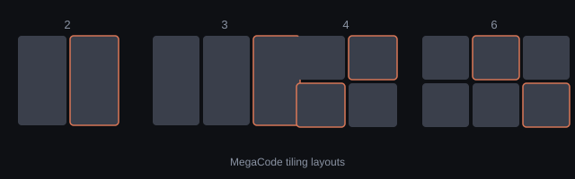

# MegaCode

Launch several **Claude Code** sessions at once, each in its own Windows
Terminal window, and tile them neatly across your monitor.

Pick **2, 3, 4 or 6** instances; MegaCode opens them and arranges them in a
logical grid:

| Instances | Layout |
|-----------|--------|
| 2 | two columns side by side |
| 3 | three columns side by side |
| 4 | 2 × 2 grid |
| 6 | 3 × 2 grid |



## Requirements (runtime)

- **Windows 10/11** (uses the Win32 API and Windows Terminal)
- **Windows Terminal** (`wt.exe`) — the default on Windows 11, installable from
  the Microsoft Store on Windows 10
- **Claude Code** (`claude`) on your `PATH`

## Run from source

```bash
# from the project root, using the project's Python 3.11 venv
.venv/Scripts/python.exe -m pip install -r requirements-dev.txt
.venv/Scripts/python.exe -m megacode          # or: PYTHONPATH=src python -m megacode
```

## Build the standalone .exe

```bash
.venv/Scripts/python.exe scripts/build.py
```

Produces a single `dist/MegaCode.exe` (no console window, no Python install
needed).

## How it works

Windows Terminal runs as a **single** `WindowsTerminal.exe` process that can
own many top-level windows, so MegaCode can't map a spawned PID to a window.
Instead it:

1. Snapshots the existing Windows Terminal windows.
2. Launches N fresh windows with `wt -w 0` (one new window each).
3. Polls until N **new** windows appear (diff against the snapshot).
4. Tiles them with pure, unit-tested geometry (`megacode/layouts.py`) and
   `MoveWindow`.

## Project layout

```
src/megacode/
  layouts.py        # pure tiling math — unit-tested
  win32_helpers.py  # ctypes wrappers around Enum/Move/Monitor (no pywin32)
  terminal.py       # launch wt + claude, then arrange
  app.py            # PySide6 UI
  __main__.py       # python -m megacode
tests/              # pytest unit tests for the layout math
scripts/build.py    # one-command .exe build
scripts/verify.py   # real-desktop functional check
megacode.spec       # PyInstaller spec
```

## Test

```bash
.venv/Scripts/python.exe -m pytest
.venv/Scripts/python.exe scripts/verify.py 2   # launches 2 real windows, checks positions
```
